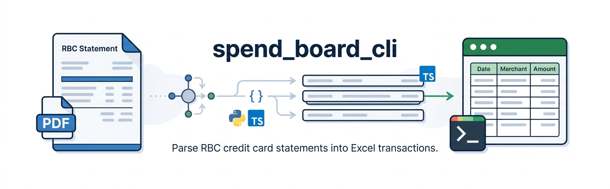

<p align="center">
  
</p>

<h1 align="center">spend_board_cli</h1>

<p align="center">
  Parse les relevés de carte de crédit <strong>RBC</strong> (PDF) et ajoute les transactions dans un fichier Excel.
</p>

<p align="center">
  
  
</p>

> ⚠️ **Limitation importante** : Cet outil a été développé et testé **uniquement sur des relevés de carte de crédit RBC**. Il n'a pas été testé sur les relevés d'autres banques canadiennes (TD, Scotia, CIBC, etc.) et les rejettera systématiquement via le détecteur de banque.

## Table des matières

- [Fonctionnalités](#fonctionnalités)
- [Prérequis](#prérequis)
- [Installation](#installation)
- [Utilisation](#utilisation)
- [Format de sortie](#format-de-sortie)
- [Architecture](#architecture)
- [Limitations connues](#limitations-connues)
- [Dépannage](#dépannage)

## Fonctionnalités

- Extraction automatique des transactions depuis un relevé PDF RBC
- Conversion intelligente des dates françaises (`15 DÉC` → `2024-12-15`)
- **Ajout à la suite** dans un fichier Excel existant, ou création d'un nouveau fichier avec en-têtes
- Parser TypeScript testable isolément pour le débogage

## Prérequis

- Python 3.10+
- Node.js 20+

## Installation

```bash
# Dépendances Node.js (pdfjs-dist, tsx)
npm install

# Package Python en mode éditable (inclut pytest)
pip install -e ".[dev]"
```

## Utilisation

### Commande principale

```bash
python3 -m spend_board_cli <releve_rbc.pdf> <transactions.xlsx>
```

- Si `transactions.xlsx` n'existe pas, il est créé avec une ligne d'en-tête.
- S'il existe, les transactions sont **ajoutées à la fin** (pas d'écrasement).

### Tester le parser TypeScript isolément

```bash
npx tsx parse.ts releve.pdf
```

Affiche le JSON parsé dans stdout (utile pour déboguer sans toucher Excel).

## Format de sortie

Fichier Excel avec 3 colonnes :

| Colonne   | Format                          | Exemple        |
|-----------|---------------------------------|----------------|
| Date      | Date ISO (AAAA-MM-JJ)           | `2024-12-15`   |
| Marchant  | Nom du marchand                 | `TIM HORTON`   |
| Montant   | Nombre (négatif = paiement/crédit) | `-45.00`    |

## Architecture

Le projet est un CLI hybride Python / TypeScript :

1. **Python** (`src/spend_board_cli/__main__.py`) appelle `parse.ts` via sous-processus (`npx tsx`)
2. **TypeScript** (`parse.ts`) utilise `pdfjs-dist` pour extraire le texte du PDF, puis exécute les parsers locaux dans `src/parsers/` et `src/pdf/`
3. Le parser retourne du JSON (banque, période du relevé, transactions)
4. **Python** convertit les dates (noms de mois en français → ISO), puis écrit les lignes dans Excel via `openpyxl`

> **Note** : Les modules `src/parsers/` et `src/pdf/` sont des copies locales synchronisées depuis le projet sibling `../spend_board`. Le source of truth reste dans `../spend_board/frontend/src/utils/`.

## Limitations connues

- **RBC uniquement** — le détecteur de banque (`src/parsers/bankDetector.ts`) rejette tout autre relevé
- **Pas de détection de doublons** — gérez la déduplication dans Excel vous-même
- **Pas de tests automatisés** — la suite pytest est configurée mais le répertoire `tests/` est vide

## Dépannage

### `Warning: Please use the 'legacy' build in Node.js environments.`
Ce warning de `pdfjs-dist` est sans conséquence et peut être ignoré. Le parser Python filtre déjà les lignes non-JSON de stdout.

### `Unsupported bank: unknown`
Le PDF fourni n'est pas un relevé RBC reconnu. Vérifiez que le PDF contient bien les mentions "Royal Bank" ou "RBC" dans les 30 premières lignes de la première page.
